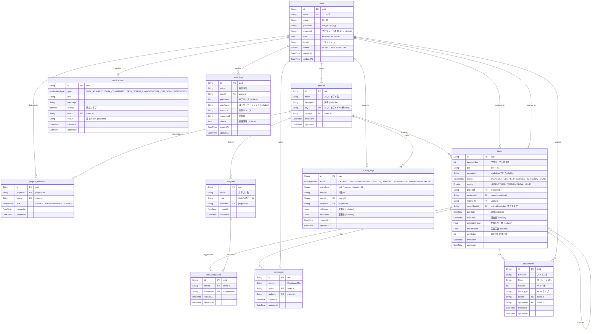

# ER図（Entity Relationship Diagram）

`prisma/schema.prisma` に基づくデータベース設計の可視化。

```mermaid
erDiagram
    %% ===== Users =====
    users {
        String id PK "cuid"
        String email UK "ユニーク"
        String name "表示名"
        String password "bcryptハッシュ"
        String avatarUrl "プロフィール画像URL (nullable)"
        Role role "ADMIN / MEMBER"
        String locale "デフォルト: ja"
        Theme theme "LIGHT / DARK / SYSTEM"
        DateTime createdAt
        DateTime updatedAt
    }

    %% ===== Projects =====
    projects {
        String id PK "cuid"
        String name "プロジェクト名"
        String description "説明 (nullable)"
        String key UK "プロジェクトキー (例: DTB)"
        String ownerId FK "users.id"
        DateTime createdAt
        DateTime updatedAt
    }

    %% ===== ProjectMembers =====
    project_members {
        String id PK "cuid"
        String projectId FK "projects.id"
        String userId FK "users.id"
        ProjectRole role "OWNER / ADMIN / MEMBER / VIEWER"
        DateTime createdAt
        DateTime updatedAt
    }

    %% ===== Tasks =====
    tasks {
        String id PK "cuid"
        Int taskNumber "プロジェクト内連番"
        String title "タイトル"
        String description "Markdown対応 (nullable)"
        TaskStatus status "BACKLOG / TODO / IN_PROGRESS / IN_REVIEW / DONE"
        Priority priority "URGENT / HIGH / MEDIUM / LOW / NONE"
        String projectId FK "projects.id"
        String assigneeId FK "users.id (nullable)"
        String reporterId FK "users.id"
        String parentTaskId FK "tasks.id (nullable, サブタスク)"
        DateTime dueDate "期限 (nullable)"
        DateTime startDate "開始日 (nullable)"
        Float estimatedHours "見積もり工数 (nullable)"
        Float actualHours "実績工数 (nullable)"
        Int sortOrder "カンバン内並び順"
        DateTime createdAt
        DateTime updatedAt
    }

    %% ===== Categories =====
    categories {
        String id PK "cuid"
        String name "カテゴリ名"
        String color "OKLCHカラー値"
        String projectId FK "projects.id"
        DateTime createdAt
        DateTime updatedAt
    }

    %% ===== TaskCategories (多対多) =====
    task_categories {
        String id PK "cuid"
        String taskId FK "tasks.id"
        String categoryId FK "categories.id"
        DateTime createdAt
        DateTime updatedAt
    }

    %% ===== Comments =====
    comments {
        String id PK "cuid"
        String content "Markdown対応"
        String taskId FK "tasks.id"
        String authorId FK "users.id"
        DateTime createdAt
        DateTime updatedAt
    }

    %% ===== Attachments =====
    attachments {
        String id PK "cuid"
        String fileName "ファイル名"
        String fileUrl "ストレージURL"
        Int fileSize "バイト数"
        String mimeType "MIMEタイプ"
        String taskId FK "tasks.id"
        String uploaderId FK "users.id"
        DateTime createdAt
        DateTime updatedAt
    }

    %% ===== ActivityLogs =====
    activity_logs {
        String id PK "cuid"
        ActivityAction action "CREATED / UPDATED / DELETED / STATUS_CHANGED / ASSIGNED / COMMENTED / ATTACHED"
        String entityType "task / comment / project 等"
        String entityId "対象ID"
        String userId FK "users.id"
        String projectId FK "projects.id"
        Json oldValue "変更前 (nullable)"
        Json newValue "変更後 (nullable)"
        DateTime createdAt
        DateTime updatedAt
    }

    %% ===== Notifications =====
    notifications {
        String id PK "cuid"
        NotificationType type "TASK_ASSIGNED / TASK_COMMENTED / TASK_STATUS_CHANGED / TASK_DUE_SOON / MENTIONED"
        String title
        String message
        Boolean isRead "既読フラグ"
        String userId FK "users.id"
        String linkUrl "遷移先URL (nullable)"
        DateTime createdAt
        DateTime updatedAt
    }

    %% ===== AuditLogs =====
    audit_logs {
        String id PK "cuid"
        String action "操作内容"
        String userId FK "users.id"
        String ipAddress "IPアドレス (nullable)"
        String userAgent "ユーザーエージェント (nullable)"
        String resource "対象リソース"
        String resourceId "対象ID"
        Json details "詳細情報 (nullable)"
        DateTime createdAt
        DateTime updatedAt
    }

    %% ===== リレーション =====

    %% Users - Projects (owner: 1:N)
    users ||--o{ projects : "owns"

    %% Users - ProjectMembers (1:N)
    users ||--o{ project_members : "belongs to"

    %% Projects - ProjectMembers (1:N)
    projects ||--o{ project_members : "has members"

    %% Projects - Tasks (1:N)
    projects ||--o{ tasks : "contains"

    %% Users - Tasks (assignee: 0..N)
    users ||--o{ tasks : "assigned to"

    %% Users - Tasks (reporter: 1:N)
    users ||--o{ tasks : "reported by"

    %% Tasks - Tasks (subtasks: self-referencing 1:N)
    tasks ||--o{ tasks : "subtasks"

    %% Projects - Categories (1:N)
    projects ||--o{ categories : "defines"

    %% Tasks - TaskCategories (1:N)
    tasks ||--o{ task_categories : "tagged with"

    %% Categories - TaskCategories (1:N)
    categories ||--o{ task_categories : "applied to"

    %% Tasks - Comments (1:N)
    tasks ||--o{ comments : "has"

    %% Users - Comments (1:N)
    users ||--o{ comments : "writes"

    %% Tasks - Attachments (1:N)
    tasks ||--o{ attachments : "has"

    %% Users - Attachments (1:N)
    users ||--o{ attachments : "uploads"

    %% Users - ActivityLogs (1:N)
    users ||--o{ activity_logs : "performs"

    %% Projects - ActivityLogs (1:N)
    projects ||--o{ activity_logs : "tracks"

    %% Users - Notifications (1:N)
    users ||--o{ notifications : "receives"

    %% Users - AuditLogs (1:N)
    users ||--o{ audit_logs : "audited"
```
